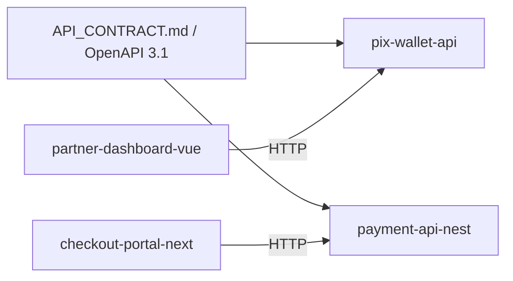

# Matheus Gonçalves

**Backend Engineer · Payments · PIX, cross-border, split**

I build payment systems: idempotent webhooks, FX rate locks, multi-currency balances, and settlement splits. Portfolio is a shared **AcmePay** API contract implemented across four stacks.

## AcmePay ecosystem

| Repo | Stack | Role |
|------|-------|------|
| [pix-wallet-api](https://github.com/MatGoncal/pix-wallet-api) | Laravel 12 · Postgres · Redis | PIX wallet API (Sail) |
| [partner-dashboard-vue](https://github.com/MatGoncal/partner-dashboard-vue) | Vue 3 · Pinia · Vite | Partner dashboard |
| [checkout-portal-next](https://github.com/MatGoncal/checkout-portal-next) | Next 15 · TanStack Query | Checkout + webhook simulator |
| [payment-api-nest](https://github.com/MatGoncal/payment-api-nest) | NestJS 11 · Prisma · BullMQ | Same contract, Nest side |

### Canonical endpoints

- `POST /v1/payments` — PIX cash-in (QR + copia-e-cola)
- `POST /v1/webhooks/payment` — idempotent provider events
- `POST /v1/fx/quotes` — rate lock (5 min)
- `GET /v1/balances` — multi-currency wallet
- `POST /v1/payouts` — async payout (debit on confirm)
- `POST /v1/payments/{id}/splits` — platform / seller / affiliate

Money is always **integer minor units** — never float.

## Focus

- Spec-driven delivery (`AGENTS.md` + `Docs/specs` before code)
- Fintech domain: settlement, idempotency, FX, split
- Laravel + Vue (hiring) and Nest + Next (marketplace / PagAmerican prep)

## Contact

GitHub: [MatGoncal](https://github.com/MatGoncal)
