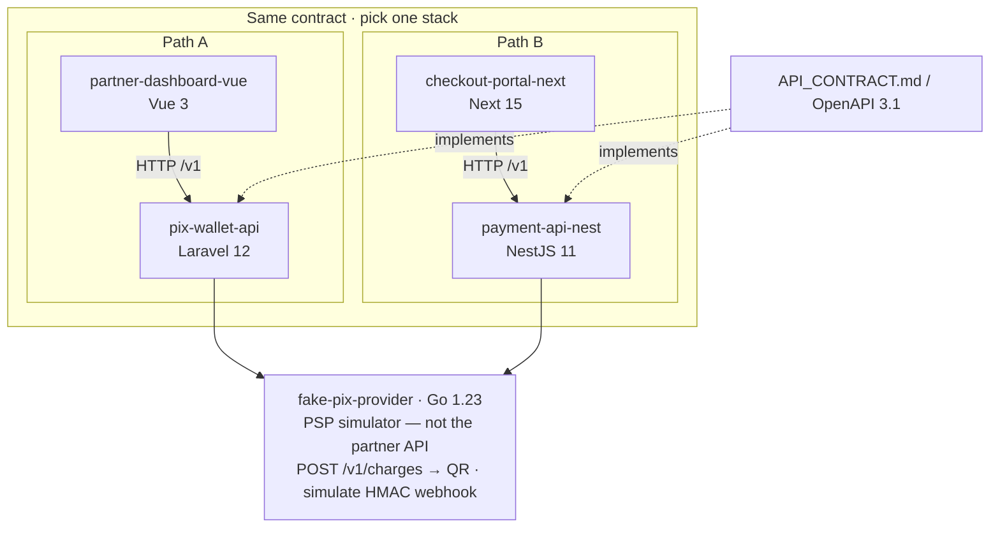

# Matheus Gonçalves

**Backend Engineer · Payments · PIX, cross-border, split**

I build payment systems: idempotent webhooks, FX rate locks, multi-currency balances, and settlement splits. Portfolio is a shared **AcmePay** API contract implemented across four stacks, plus a Go PSP simulator that signs the same webhook.

## AcmePay ecosystem

| Repo | Stack | Role |
|------|-------|------|
| [pix-wallet-api](https://github.com/MatGoncal/pix-wallet-api) | Laravel 12 · Postgres · Redis | PIX wallet API (Sail) |
| [partner-dashboard-vue](https://github.com/MatGoncal/partner-dashboard-vue) | Vue 3 · Pinia · Vite | Partner dashboard |
| [checkout-portal-next](https://github.com/MatGoncal/checkout-portal-next) | Next 15 · TanStack Query | Checkout + webhook simulator |
| [payment-api-nest](https://github.com/MatGoncal/payment-api-nest) | NestJS 11 · Prisma · BullMQ | Same contract, Nest side |
| [fake-pix-provider](https://github.com/MatGoncal/fake-pix-provider) | Go 1.23 · stdlib | Synthetic PIX PSP (simulator, not the partner API) |

Pick any contract repo — the same OpenAPI 3.1 spec lives in `Docs/specs/`.
The Go provider is a standalone PSP simulator: it does **not** implement
`POST /v1/payments`.

One contract, two stacks — run **one**. Each frontend talks only to its API.
Both APIs call Go `POST /v1/charges` for the QR; Go `simulate` posts the HMAC
webhook to `/v1/webhooks/payment`. Next `POST /api/simulator/fire` is a
parallel demo, not the PSP flow.

### Canonical endpoints

- `POST /v1/payments` — PIX cash-in (QR + copia-e-cola)
- `POST /v1/webhooks/payment` — idempotent provider events
- `POST /v1/fx/quotes` — rate lock (5 min)
- `GET /v1/balances` — multi-currency wallet
- `POST /v1/payouts` — async payout (reserve `available → pending` on create)
- `POST /v1/payments/{id}/splits` — platform / seller / affiliate

Money is always **integer minor units** — never float. Payout holds live in
`pending` until the job confirms; `available + pending` must match the ledger.

### Local demo

Pick **one** stack — [pix-wallet-api](https://github.com/MatGoncal/pix-wallet-api)
Sail **or** [payment-api-nest](https://github.com/MatGoncal/payment-api-nest)
compose. Both publish [fake-pix-provider](https://github.com/MatGoncal/fake-pix-provider)
on `:8080`. `git pull` and `up --build` so the Go image has Postgres.

Create a PIX, restart the PSP: `GET /v1/charges/by-payment/{id}` still 200; the
outbox retries the webhook. Stop the PSP → **502**; retry the same
`Idempotency-Key` → same payment `id`.

[partner-dashboard-vue](https://github.com/MatGoncal/partner-dashboard-vue)
defaults to `demo-partner-key` (Nest / mock). Against Laravel set
`VITE_API_KEY=acmepay_demo_key_change_me` (and proxy `/v1` via
`VITE_MOCK_TARGET=http://localhost`). The UI sends `Idempotency-Key`
(`pay:{external_id}` or a UUID in memory), so double-submit and a 502 retry
reuse one charge. Checkout lives in
[checkout-portal-next](https://github.com/MatGoncal/checkout-portal-next).

## Focus

- Spec-driven delivery (`AGENTS.md` + `Docs/specs` before code)
- Fintech domain: settlement, idempotency, FX, split
- Laravel + Vue (hiring) and Nest + Next (marketplace / PagAmerican prep)

## Contact

- LinkedIn: [matheusgoncalvesweb](https://www.linkedin.com/in/matheusgoncalvesweb/)
- Email: matheus.gabryel10@gmail.com
